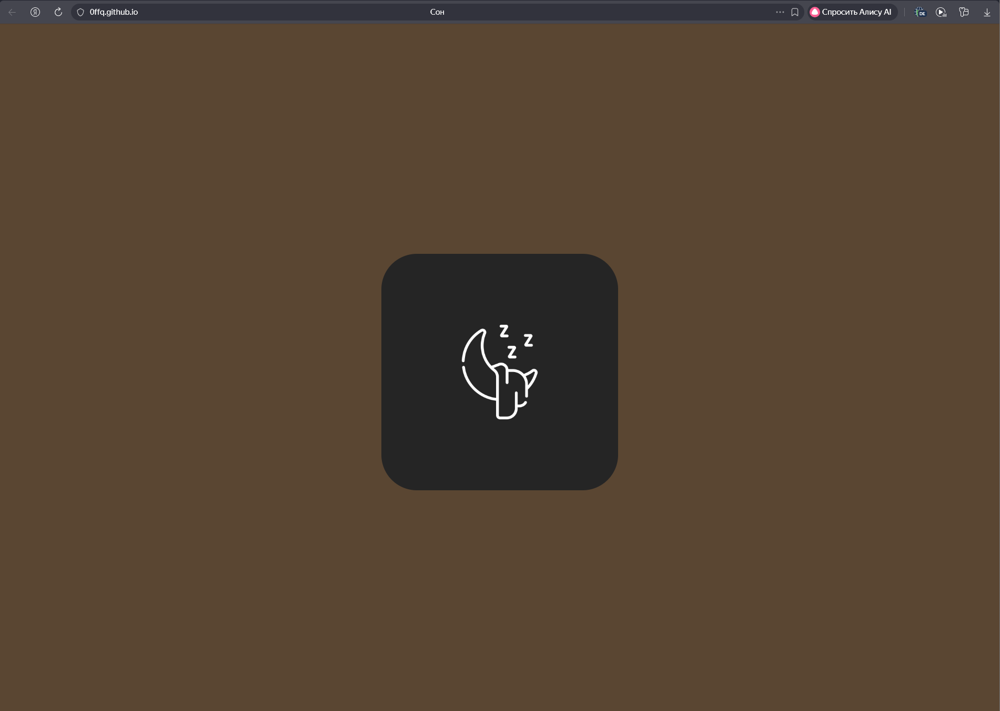
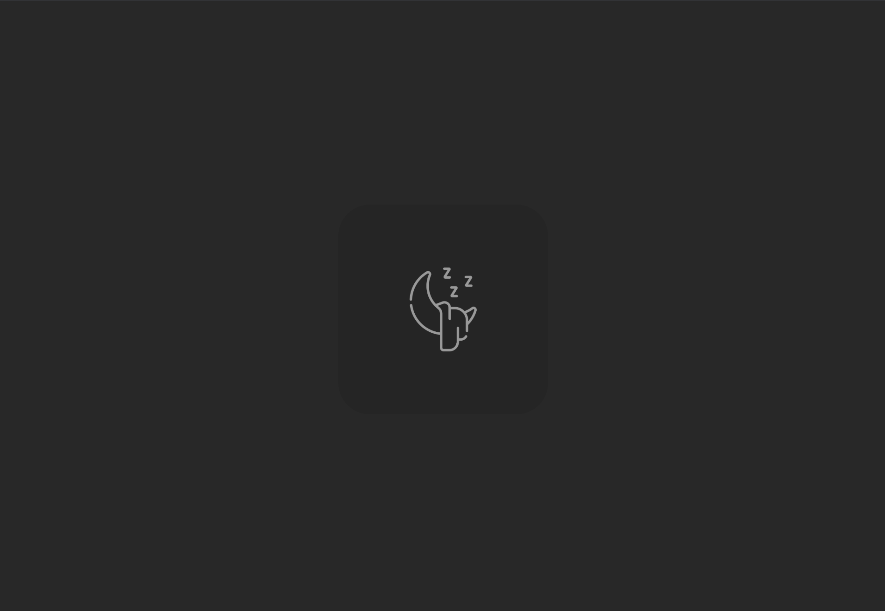

# 🌧️ Sleep - Rain for Sleep

  

## 📋 About

**Sleep** is an ultra-minimalist website designed for one purpose: **fall asleep faster**.  
No unnecessary interface - just open the page, **one click on the icon**, and endless rain sounds help you relax and drift off.

---

## 🛠️ Tech Stack

  
  
  
  
  
  

---

## 🔗 Live Demo

👉 **[https://0ffq.github.io/Sleep/](https://0ffq.github.io/Sleep/)**

---

## 🖥️ Screenshots

  
    
  

